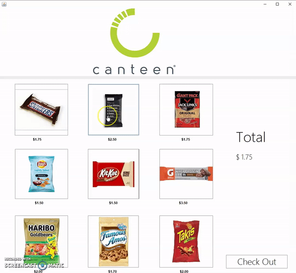

# Virtual Vending Machine 

A Virtual Vending Machine designed using Java Swing. The gif below shows the output.  

  

The user is allowed to choose from a list of items. The bill changes live according to what the user picks from the vending machine. After the user is finished selecting items and presses the "check out" button, the program shows the amount of times each item was chosen. Lastly, the final bill is showed. 
